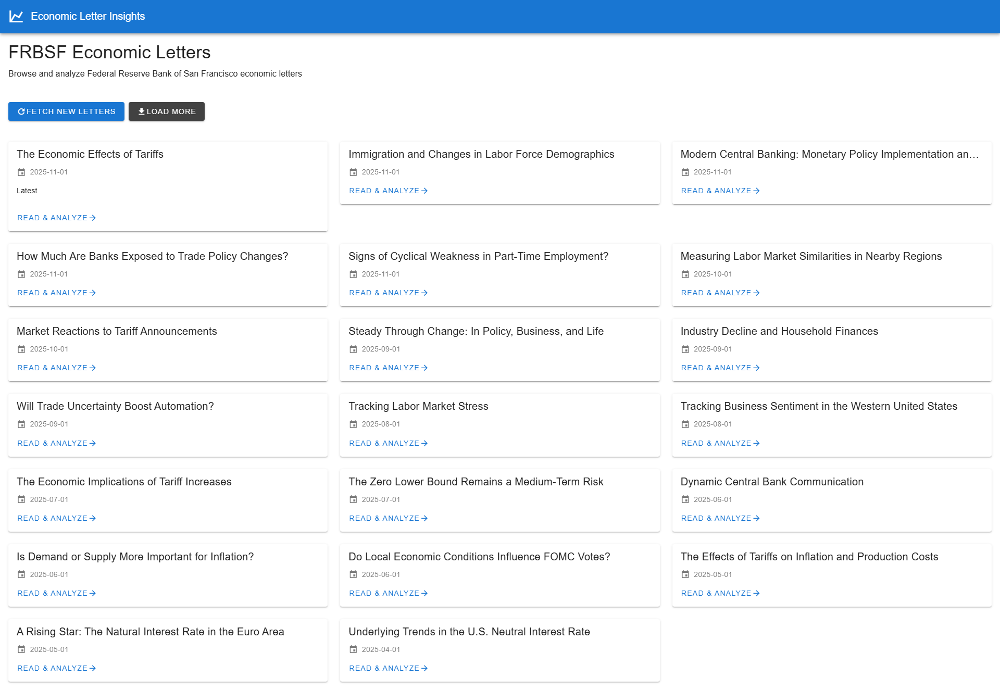
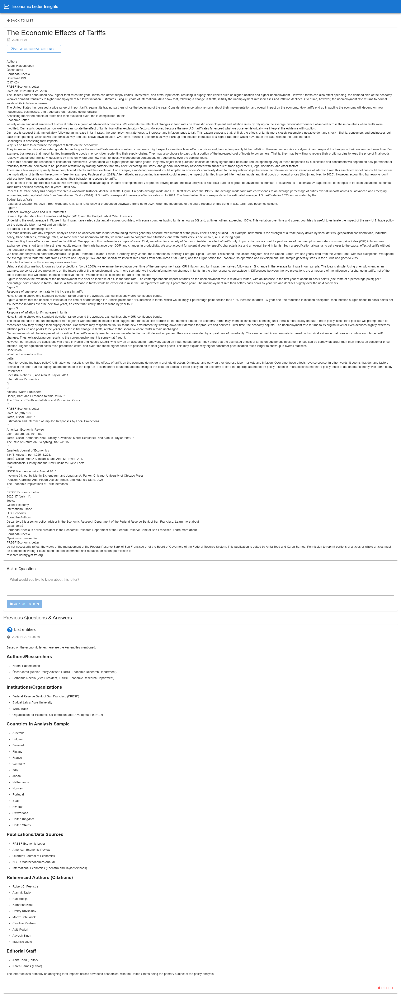
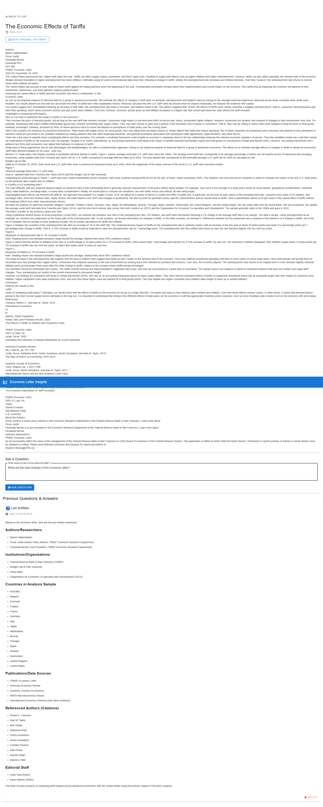
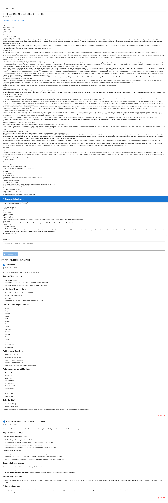

# Economic Letter Insights

AI-powered analysis of Federal Reserve Bank of San Francisco (FRBSF) economic letters using AWS Bedrock.

## 📸 Application Screenshots

<table>
  <tr>
    <td width="50%">
      
      <p align="center"><b>Browse Economic Letters</b></p>
    </td>
    <td width="50%">
      
      <p align="center"><b>View Letter Details</b></p>
    </td>
  </tr>
  <tr>
    <td width="50%">
      
      <p align="center"><b>Ask Questions</b></p>
    </td>
    <td width="50%">
      
      <p align="center"><b>Get AI-Powered Insights</b></p>
    </td>
  </tr>
</table>

---

## 🚀 Built by Kiro AI in 45 Minutes

**💰 Value:** $7,499 saved | 113x faster | 3,400+ lines of code  
**📊 Deliverables:** 32 files | Full-stack app | Complete documentation  

**[→ See Executive Summary for detailed metrics](EXECUTIVE_SUMMARY.md)**

---

## Features

- 📊 Browse economic letters from FRBSF
- 🔄 Fetch new and historical letters
- 🤖 Ask questions about letters using AI (AWS Bedrock Claude Sonnet)
- 💾 Store questions and answers for future reference
- 🗑️ Delete previous questions
- 🔗 Navigate to original FRBSF publications

## Technology Stack

- **Backend**: FastAPI (Python)
- **Frontend**: VueJS 3 + Vuetify 3 (Single HTML file)
- **Database**: SQLite
- **AI**: AWS Bedrock (Claude Sonnet)
- **Package Management**: UV

## Prerequisites

- Python 3.11+
- UV (Python package manager)
- AWS credentials configured (using profile: aws-admin-profile)
- Access to AWS Bedrock in us-east-1 region

## Installation

1. Clone the repository:
```bash
git clone <repository-url>
cd frbsf-economic-letters-by-kiro
```

2. Install dependencies using UV:
```bash
uv sync
```

3. Configure environment variables:
```bash
cp .env.example .env
# Edit .env if needed
```

## Running the Application

Start the application using UV:

```bash
uv run python run.py
```

The application will be available at: http://localhost:8000

## Usage

1. **Browse Letters**: Open the application in your browser to see the list of economic letters
2. **Fetch New Letters**: Click "Fetch New Letters" to scrape the latest publications from FRBSF
3. **Load More**: Click "Load More" to fetch older letters from the archive
4. **Analyze Letters**: Click on any letter to view its content
5. **Ask Questions**: Type your question in the text area and click "Ask Question" to get AI-powered insights
6. **View History**: Previous questions and answers are displayed below the question form
7. **Delete Questions**: Click the delete button to remove any question-answer pair

## Project Structure

```
.
├── app/
│   ├── db/
│   │   ├── database.py       # Database initialization
│   │   ├── repository.py     # Database operations
│   │   └── schema.py         # Database schema
│   ├── models/
│   │   └── schemas.py        # Pydantic models
│   ├── services/
│   │   ├── llm.py           # AWS Bedrock LLM service
│   │   └── scraper.py       # Web scraping service
│   ├── config.py            # Configuration management
│   └── main.py              # FastAPI application
├── static/
│   └── index.html           # VueJS frontend
├── data/
│   └── letters.db           # SQLite database (created automatically)
├── .env                     # Environment variables
├── .env.example             # Environment variables template
├── pyproject.toml           # Python dependencies
└── run.py                   # Application entry point
```

## API Endpoints

- `GET /` - Serve frontend
- `GET /api/letters` - Get paginated list of letters
- `POST /api/letters/fetch-new` - Fetch new letters from FRBSF
- `POST /api/letters/fetch-more` - Fetch older letters
- `GET /api/letters/{letter_id}` - Get letter details with questions
- `POST /api/letters/{letter_id}/questions` - Submit a question
- `DELETE /api/questions/{question_id}` - Delete a question

## Configuration

Environment variables (in `.env`):

```
# AWS Configuration
AWS_DEFAULT_PROFILE=aws-admin-profile
AWS_REGION=us-east-1
BEDROCK_MODEL_ID=anthropic.claude-sonnet-4-5-20250929-v1:0

# Database
DATABASE_PATH=./data/letters.db

# Application
HOST=0.0.0.0
PORT=8000
DEBUG=false

# Scraping
FRBSF_BASE_URL=https://www.frbsf.org/research-and-insights/publications/economic-letter/
SCRAPE_TIMEOUT=30
MAX_RETRIES=3
```

## Development

The application uses UV for package management. To add new dependencies:

```bash
uv add <package-name>
```

To run in debug mode, set `DEBUG=true` in `.env`.

## Notes

- The application runs on EC2 with an IAM role, so no explicit AWS credentials are needed
- The SQLite database is created automatically on first run
- All letter content is stored locally for faster access
- Questions and answers are persisted in the database

## License

MIT
